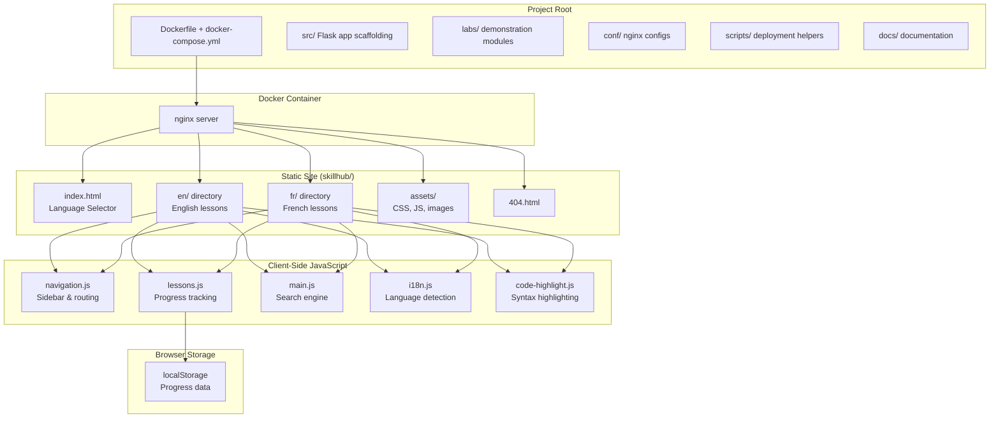
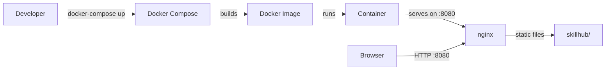

# Design Document: OPCP Introduction Skillhub

## Overview

The OPCP Introduction Skillhub is a static training website designed to educate non-technical personnel (sales team, business stakeholders, project managers) on OVHcloud's Hosted Private Cloud (OPCP) service. The site is built as a pure client-side HTML/CSS/JavaScript application served by nginx within a Docker container.

**Key Design Decisions:**

1. **Static site architecture** — No server-side rendering or backend logic. All interactivity (search, progress tracking, navigation) is handled client-side via JavaScript and localStorage. This simplifies deployment and ensures the site works offline once loaded.

2. **Bilingual via directory mirroring** — English and French content live in separate `en/` and `fr/` directories with identical file structures. This avoids runtime translation complexity and allows content to be authored independently per language.

3. **localStorage for state** — Progress tracking uses the browser's localStorage API. No user accounts, no server-side persistence. This is appropriate for a training tool where data loss is low-impact and privacy is preserved.

4. **Client-side search** — A pre-built search index (JSON) is loaded at page init and queried in-browser. No search server needed.

5. **Follows opcp-openstack-first-steps structure** — The project mirrors an established internal project layout including Flask scaffolding files (for potential future admin features), Docker deployment, and lab modules.

## Architecture



### Deployment Architecture



The site is entirely self-contained within the Docker image. No external CDN dependencies, no runtime network fetches. The nginx configuration serves the `skillhub/` directory as the document root with appropriate MIME types and caching headers.

### File System Layout

```
opcp-introduction/
├── app.py                      # Root Flask entry point (scaffolding)
├── Dockerfile                  # Multi-stage build: copy skillhub + nginx
├── docker-compose.yml          # Service definition, port mapping (8080)
├── requirements.txt            # Python dependencies (Flask scaffolding)
├── README.md                   # Project documentation
├── Prerequisites.md            # Setup prerequisites
├── .gitignore
├── src/
│   ├── __init__.py
│   ├── app.py                  # Flask app factory
│   ├── config.py               # Flask configuration
│   └── database.py             # Database utilities (scaffolding)
├── templates/
│   ├── index.html              # Flask admin template
│   ├── admin.html              # Admin panel template
│   └── billing.html            # Billing template
├── conf/
│   ├── deploy.ini              # Deployment configuration
│   ├── nginx.conf              # Base nginx config
│   └── nginx.conf.template     # Templated nginx config
├── scripts/
│   ├── backup.sh               # Backup utility
│   └── init_website.sh         # Initialization script
├── running_skillhub/
│   └── nginx.conf              # Docker-specific nginx config
├── skillhub/                   # ← Static training website
│   ├── index.html              # Language selector landing page
│   ├── 404.html                # Error page
│   ├── assets/
│   │   ├── css/
│   │   │   └── style.css       # Main stylesheet
│   │   ├── js/
│   │   │   ├── main.js         # App initialization + search
│   │   │   ├── lessons.js      # Progress tracking logic
│   │   │   ├── navigation.js   # Sidebar + routing
│   │   │   ├── i18n.js         # Language detection/switching
│   │   │   └── code-highlight.js # Syntax highlighting
│   │   └── images/             # Diagrams, screenshots, icons
│   ├── en/                     # English lesson pages
│   │   ├── introduction/
│   │   │   ├── what-is-opcp.html
│   │   │   ├── benefits.html
│   │   │   ├── target-audience.html
│   │   │   └── key-features.html
│   │   ├── getting-started/
│   │   │   ├── account-setup.html
│   │   │   ├── dashboard-access.html
│   │   │   ├── navigation.html
│   │   │   └── initial-configuration.html
│   │   ├── core-concepts/
│   │   │   ├── node-lifecycle.html
│   │   │   ├── node-types.html
│   │   │   ├── resource-allocation.html
│   │   │   └── network-architecture.html
│   │   ├── technical-operations/
│   │   │   ├── instance-setup.html
│   │   │   ├── api-credentials.html
│   │   │   ├── node-configuration.html
│   │   │   └── lacp-trunk-raid.html
│   │   ├── storage/
│   │   │   ├── cloudstore-overview.html
│   │   │   ├── storage-capabilities.html
│   │   │   ├── data-management.html
│   │   │   └── backup-recovery.html
│   │   └── best-practices/
│   │       ├── operations-security.html
│   │       ├── performance-troubleshooting.html
│   │       ├── resources-support.html
│   │       └── quick-reference.html
│   └── fr/                     # French lesson pages (mirrors en/)
│       └── ... (identical structure)
├── labs/
│   └── lab-01-dashboard-tour/
│       ├── README.md
│       ├── lab_config.yaml
│       ├── exercises/
│       │   └── 01-explore-dashboard.py
│       ├── setup/
│       │   └── setup.sh
│       └── solutions/
│           └── 01-solution.py
└── docs/
    └── architecture.md
```

## Components and Interfaces

### 1. Language Selector (`index.html` + `i18n.js`)

**Responsibility:** Detect browser language preference and route users to the appropriate language directory.

**Interface:**
```javascript
// i18n.js
const I18n = {
  /**
   * Detects browser preferred language.
   * @returns {'en' | 'fr'} - Detected language, defaults to 'en'
   */
  detectLanguage(): string,

  /**
   * Redirects user to the selected language directory.
   * @param {string} lang - 'en' or 'fr'
   */
  selectLanguage(lang: string): void,

  /**
   * Navigates to the equivalent page in the other language.
   * Preserves current lesson path.
   * @param {string} targetLang - Target language code
   */
  switchLanguage(targetLang: string): void
};
```

**Behavior:**
- On `index.html` load, reads `navigator.language` or `navigator.languages[0]`
- If starts with `fr`, pre-selects French; otherwise defaults to English
- Language switch on lesson pages replaces `/en/` with `/fr/` (or vice versa) in the current URL path

### 2. Navigation System (`navigation.js`)

**Responsibility:** Render sidebar menu, handle active state, manage responsive behavior, provide sequential navigation.

**Interface:**
```javascript
// navigation.js
const Navigation = {
  /**
   * Initializes the sidebar with lesson structure.
   * @param {LessonStructure} structure - Hierarchical lesson data
   * @param {string} currentPage - Current page path
   */
  init(structure: LessonStructure, currentPage: string): void,

  /**
   * Highlights the active lesson in the sidebar.
   * @param {string} pagePath - Path of the active page
   */
  setActive(pagePath: string): void,

  /**
   * Updates completion indicators based on progress data.
   * @param {ProgressData} progress - Current progress state
   */
  updateCompletionIndicators(progress: ProgressData): void,

  /**
   * Returns the previous and next lesson relative to current.
   * @param {string} currentPage - Current page path
   * @returns {{ prev: string|null, next: string|null }}
   */
  getSequentialNav(currentPage: string): { prev: string|null, next: string|null },

  /**
   * Toggles mobile navigation overlay.
   */
  toggleMobileNav(): void
};
```

**Behavior:**
- Renders hierarchical sidebar from a lesson structure definition (JSON or JS object)
- Sections are collapsible; clicking a section header expands/collapses its children
- Active page gets distinct styling (background color + font weight)
- Completed lessons show a checkmark icon
- Below 768px: sidebar collapses to hamburger; opens as overlay
- Overlay dismisses on outside click or close button
- Previous/Next buttons rendered at page bottom; hidden when at boundaries

### 3. Progress Tracker (`lessons.js`)

**Responsibility:** Track lesson completion via localStorage, calculate overall progress, restore state on return visits.

**Interface:**
```javascript
// lessons.js
const ProgressTracker = {
  /**
   * Initializes progress tracking for the current page.
   * Sets up scroll observer to detect lesson completion.
   */
  init(): void,

  /**
   * Marks a specific lesson as completed.
   * @param {string} lessonId - Unique lesson identifier (e.g., 'en/introduction/what-is-opcp')
   */
  markCompleted(lessonId: string): void,

  /**
   * Checks if a lesson has been completed.
   * @param {string} lessonId - Lesson identifier
   * @returns {boolean}
   */
  isCompleted(lessonId: string): boolean,

  /**
   * Calculates overall completion percentage.
   * @param {string} lang - Current language ('en' or 'fr')
   * @returns {number} - Percentage 0-100, rounded to nearest integer
   */
  getCompletionPercentage(lang: string): number,

  /**
   * Returns all completion data from localStorage.
   * @returns {ProgressData} - Map of lessonId to completion status
   */
  getProgressData(): ProgressData,

  /**
   * Resets all progress data.
   */
  reset(): void
};
```

**Behavior:**
- Uses an IntersectionObserver on the last content element of each lesson page
- When the last element enters the viewport, marks the lesson as completed
- Stores data in localStorage under key `opcp-progress`
- On init, reads existing progress and updates navigation indicators
- If localStorage is unavailable or data is corrupted, silently degrades (all lessons show as incomplete)
- Completion percentage = `(completedLessons.length / totalLessons) * 100`, rounded

### 4. Search Engine (`main.js`)

**Responsibility:** Client-side full-text search across lesson content.

**Interface:**
```javascript
// main.js (search portion)
const Search = {
  /**
   * Initializes search index from pre-built data.
   * @param {SearchIndex} index - Pre-built search index
   */
  init(index: SearchIndex): void,

  /**
   * Performs a search query.
   * @param {string} query - User search input (minimum 2 characters)
   * @returns {SearchResult[]} - Ordered results, max 20
   */
  search(query: string): SearchResult[],

  /**
   * Highlights matching terms in result text.
   * @param {string} text - Original text
   * @param {string} query - Search query
   * @returns {string} - HTML with <mark> tags around matches
   */
  highlight(text: string, query: string): string
};
```

**Behavior:**
- Search index is a JSON file (`search-index.json`) containing page titles, headings, and body text excerpts per lesson
- Index is loaded once on first search interaction (lazy loading)
- Matching is case-insensitive substring search
- Results ranked: title matches first, then heading matches, then body matches
- Maximum 20 results displayed
- Results must appear within 500ms of query submission
- Empty results show a helpful message with suggestions

### 5. Code Highlighter (`code-highlight.js`)

**Responsibility:** Apply CSS-based syntax highlighting to code blocks.

**Interface:**
```javascript
// code-highlight.js
const CodeHighlight = {
  /**
   * Scans page for code blocks and applies highlighting.
   */
  init(): void,

  /**
   * Highlights a specific code block element.
   * @param {HTMLElement} block - The <code> or <pre> element
   */
  highlightBlock(block: HTMLElement): void,

  /**
   * Copies code block content to clipboard.
   * @param {HTMLElement} block - The code block element
   * @returns {Promise<boolean>} - Success status
   */
  copyToClipboard(block: HTMLElement): Promise<boolean>
};
```

**Behavior:**
- On page load, finds all `<pre><code>` elements
- Applies CSS classes for token types: keywords (blue), strings (green), comments (gray) — minimum 3 distinct colors
- Adds a "Copy" button to each code block
- On copy: uses `navigator.clipboard.writeText()`, shows confirmation for 2 seconds
- On copy failure: shows error notification

### 6. Lab Module Structure

**Responsibility:** Provide guided demonstration exercises following a standardized directory layout.

**Configuration Interface (`lab_config.yaml`):**
```yaml
title: "Dashboard Tour"
description: "Explore the OPCP dashboard interface"
duration_minutes: 15
prerequisites: []
exercises:
  - file: "exercises/01-explore-dashboard.py"
    title: "Navigating the Dashboard"
    steps: 8
```

**Behavior:**
- Each lab module is a self-contained directory under `labs/`
- README.md describes prerequisites, software requirements, and total step count (max 15 per exercise)
- Exercises are walkthrough-style: numbered steps with action descriptions and expected outcomes
- Setup scripts in `setup/` execute with a single command, no arguments
- Scripts include error handling with descriptive messages and remediation suggestions

## Data Models

### ProgressData (localStorage)

```typescript
interface ProgressData {
  version: 1;
  lang: string;                    // Current language context
  completedLessons: string[];      // Array of completed lesson IDs
  lastVisited: string;             // Last visited lesson ID
  lastUpdated: string;             // ISO 8601 timestamp
}
```

**Storage key:** `opcp-progress`

**Example:**
```json
{
  "version": 1,
  "lang": "en",
  "completedLessons": [
    "en/introduction/what-is-opcp",
    "en/introduction/benefits",
    "en/getting-started/account-setup"
  ],
  "lastVisited": "en/getting-started/dashboard-access",
  "lastUpdated": "2024-01-15T10:30:00Z"
}
```

### LessonStructure (Navigation Data)

```typescript
interface LessonSection {
  id: string;                      // Section identifier
  title: string;                   // Display title
  lessons: LessonEntry[];          // Ordered list of lessons
}

interface LessonEntry {
  id: string;                      // Unique lesson ID (path-based)
  title: string;                   // Display title
  file: string;                    // Relative path to HTML file
  difficulty: 'beginner' | 'intermediate' | 'advanced';
}

type LessonStructure = LessonSection[];
```

### SearchIndex

```typescript
interface SearchIndexEntry {
  id: string;                      // Lesson ID
  title: string;                   // Page title
  headings: string[];              // All h2/h3 headings on the page
  body: string;                    // Stripped text content (first 500 chars)
  path: string;                    // Relative URL path
}

type SearchIndex = SearchIndexEntry[];
```

### SearchResult

```typescript
interface SearchResult {
  lessonId: string;                // Matching lesson ID
  title: string;                   // Page title
  snippet: string;                 // Context snippet with match
  path: string;                    // URL to navigate to
  matchType: 'title' | 'heading' | 'body';  // Where the match occurred
}
```

### LabConfig

```typescript
interface LabConfig {
  title: string;
  description: string;
  duration_minutes: number;
  prerequisites: string[];         // List of prerequisite module IDs
  exercises: ExerciseEntry[];
}

interface ExerciseEntry {
  file: string;                    // Relative path to exercise file
  title: string;                   // Exercise display title
  steps: number;                   // Number of steps (max 15)
}
```


## Correctness Properties

*A property is a characteristic or behavior that should hold true across all valid executions of a system — essentially, a formal statement about what the system should do. Properties serve as the bridge between human-readable specifications and machine-verifiable correctness guarantees.*

### Property 1: Language detection correctness

*For any* browser language string, the `detectLanguage` function SHALL return `'fr'` if the string starts with `'fr'` (case-insensitive), and `'en'` otherwise.

**Validates: Requirements 3.1, 3.2**

### Property 2: Language switch path transformation

*For any* valid lesson page path containing a language prefix (`/en/` or `/fr/`) and a target language, the `switchLanguage` function SHALL produce a path identical to the original except with the language prefix replaced by the target language prefix.

**Validates: Requirements 3.6**

### Property 3: Sequential navigation boundaries

*For any* lesson structure and any lesson within that structure, `getSequentialNav` SHALL return `prev: null` if and only if the lesson is first in the sequence, `next: null` if and only if the lesson is last in the sequence, and valid adjacent lesson IDs otherwise.

**Validates: Requirements 4.4, 4.5, 4.6**

### Property 4: Completion percentage calculation

*For any* set of completed lesson IDs and total lesson count (where total > 0), `getCompletionPercentage` SHALL return `Math.round((completedCount / totalCount) * 100)` where `completedCount` is the number of completed IDs that exist in the total lesson set.

**Validates: Requirements 5.2**

### Property 5: Progress data round-trip

*For any* valid `ProgressData` object, storing it to localStorage and then retrieving it SHALL produce an object with identical `completedLessons`, `lastVisited`, and `version` values.

**Validates: Requirements 5.3**

### Property 6: Search returns only matching results

*For any* search index and query string of 2 or more characters, every result returned by the `search` function SHALL contain the query as a case-insensitive substring in at least one of: title, headings, or body text.

**Validates: Requirements 18.1**

### Property 7: Search results ordering and limit

*For any* search results returned by the `search` function, title matches SHALL appear before heading matches, heading matches SHALL appear before body matches, and the total number of results SHALL NOT exceed 20.

**Validates: Requirements 18.2**

### Property 8: Search highlight preserves content

*For any* text string and query string, the `highlight` function SHALL wrap all case-insensitive occurrences of the query in `<mark>` tags without altering any characters outside the matched substrings.

**Validates: Requirements 18.3**

### Property 9: Bilingual content mirror

*For any* HTML file present in the `en/` directory, a corresponding HTML file with the same relative path SHALL exist in the `fr/` directory, and vice versa.

**Validates: Requirements 2.7, 3.4**

### Property 10: Lab configuration schema validity

*For any* `lab_config.yaml` file in the labs directory, it SHALL parse as valid YAML containing the required fields (title, description, duration_minutes, prerequisites, exercises), and every exercise entry SHALL have a `steps` value not exceeding 15.

**Validates: Requirements 17.3, 17.7**

### Property 11: Internal links use relative paths

*For any* `href` or `src` attribute in any HTML file within the skillhub that references an internal resource (not an external URL), the path SHALL be relative (not starting with `/` or a protocol scheme).

**Validates: Requirements 2.8**

## Error Handling

### localStorage Failures

| Scenario | Behavior |
|----------|----------|
| localStorage unavailable (private browsing, disabled) | Progress tracking degrades silently. All lessons show as incomplete. Site remains fully functional. |
| Corrupted/unparseable progress data | Reset to empty state. Log warning to console. Continue without progress. |
| localStorage quota exceeded | Catch the QuotaExceededError, log warning, continue without persisting new completions. |

### Search Failures

| Scenario | Behavior |
|----------|----------|
| Search index fails to load | Display "Search unavailable" message. Site navigation remains functional. |
| Query too short (< 2 chars) | Do not execute search. Show hint text indicating minimum query length. |
| No results found | Display "No results found" message with suggestions to try shorter keywords or check spelling. |

### Clipboard Failures

| Scenario | Behavior |
|----------|----------|
| `navigator.clipboard` unavailable | Fall back to `document.execCommand('copy')`. If that also fails, show error notification. |
| Clipboard write rejected (permissions) | Display notification: "Copy failed. Please select and copy manually." |

### Docker/Deployment Failures

| Scenario | Behavior |
|----------|----------|
| Port 8080 already in use | docker-compose.yml allows port override via environment variable. |
| Missing static files in image | Dockerfile build fails at COPY step with clear error indicating missing source directory. |
| nginx config syntax error | Container fails to start; nginx logs the config error to stderr. |

### Navigation Edge Cases

| Scenario | Behavior |
|----------|----------|
| Direct URL access to non-existent page | nginx serves 404.html with link back to index.html. |
| Language directory mismatch (e.g., /en/ page links to missing /fr/ equivalent) | Build-time validation ensures 1:1 mirror. If a page is missing at runtime, 404.html is served. |
| JavaScript disabled | Static HTML content remains readable. Navigation sidebar renders from HTML. Progress tracking and search are unavailable. |

## Testing Strategy

### Unit Tests (Example-Based)

Unit tests cover specific scenarios, edge cases, and integration points:

- **Language selector**: Verify redirect to `/en/` and `/fr/` on selection
- **Navigation rendering**: Verify sidebar renders all sections from structure data
- **Active page highlighting**: Verify correct CSS class applied to current page
- **Completion indicator**: Verify checkmark appears for completed lessons
- **Mobile navigation**: Verify hamburger menu behavior at < 768px
- **Code highlighting**: Verify 3+ distinct token colors applied
- **Copy to clipboard**: Verify clipboard content and confirmation display
- **localStorage unavailable**: Verify graceful degradation
- **404 page**: Verify link back to index.html exists
- **CSS branding**: Verify OVHcloud colors (#000E9C, #4949FF) in stylesheet
- **Docker health**: Verify HTTP 200 on root path within 10 seconds of container start

### Property-Based Tests

Property tests verify universal correctness across generated inputs. Each property test runs a minimum of 100 iterations.

**Library:** [fast-check](https://github.com/dubzzz/fast-check) (JavaScript property-based testing)

| Property | Tag | Generators |
|----------|-----|------------|
| Property 1: Language detection | `Feature: opcp-introduction, Property 1: Language detection correctness` | Random strings, strings starting with 'fr'/'FR'/'fr-FR', random locale codes |
| Property 2: Language switch | `Feature: opcp-introduction, Property 2: Language switch path transformation` | Random path segments, random language prefixes |
| Property 3: Sequential navigation | `Feature: opcp-introduction, Property 3: Sequential navigation boundaries` | Random lesson structures (1-50 lessons), random positions |
| Property 4: Completion percentage | `Feature: opcp-introduction, Property 4: Completion percentage calculation` | Random subsets of lesson IDs, random total counts |
| Property 5: Progress round-trip | `Feature: opcp-introduction, Property 5: Progress data round-trip` | Random ProgressData objects with valid structure |
| Property 6: Search correctness | `Feature: opcp-introduction, Property 6: Search returns only matching results` | Random search indices (1-100 entries), random query strings (2+ chars) |
| Property 7: Search ordering | `Feature: opcp-introduction, Property 7: Search results ordering and limit` | Random indices with matches in title/heading/body positions |
| Property 8: Search highlight | `Feature: opcp-introduction, Property 8: Search highlight preserves content` | Random text strings, random query substrings |
| Property 9: Bilingual mirror | `Feature: opcp-introduction, Property 9: Bilingual content mirror` | File system scan (static analysis, not generated) |
| Property 10: Lab config | `Feature: opcp-introduction, Property 10: Lab configuration schema validity` | File system scan + YAML parsing |
| Property 11: Relative paths | `Feature: opcp-introduction, Property 11: Internal links use relative paths` | HTML file scan + link extraction |

**Note:** Properties 9-11 are structural validation properties that scan actual project files rather than using random generation. They are still universally quantified ("for all files...") but operate on the real file set rather than generated inputs.

### Smoke Tests

Smoke tests verify project structure and content presence:

- All required root files exist and are non-empty (Requirement 1)
- All required directories exist with expected contents (Requirements 1, 2)
- All lesson pages exist for both languages (Requirements 6-11)
- Lab modules follow required directory structure (Requirement 17)

### Integration Tests

Integration tests verify deployment and cross-component behavior:

- Docker container builds and starts successfully
- nginx serves static content on port 8080
- HTTP 200 response within 10 seconds of container start
- Color contrast ratios meet WCAG requirements (via axe-core)
- Keyboard navigation works across all interactive elements
- Responsive layout at 320px, 768px, 1024px, 2560px viewports

### Test Execution

```bash
# Unit + Property tests
npx vitest --run

# Smoke tests (project structure validation)
npx vitest --run tests/smoke/

# Integration tests (requires Docker)
docker-compose up -d && npx vitest --run tests/integration/
```
